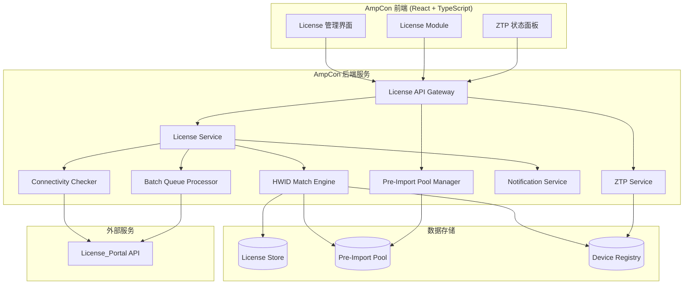
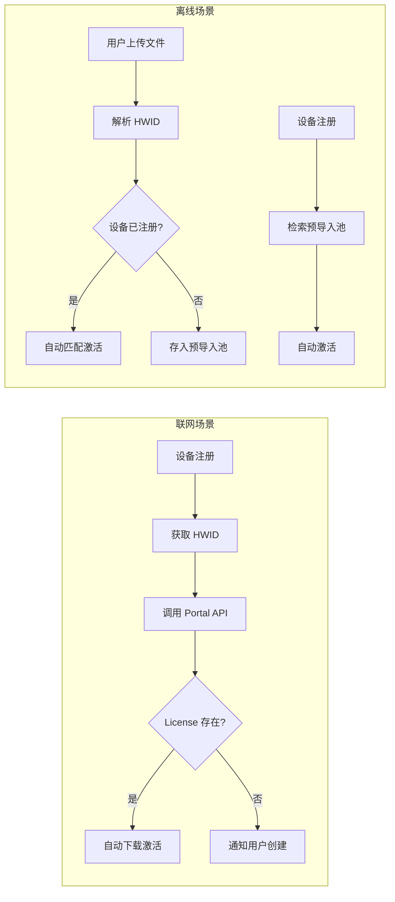
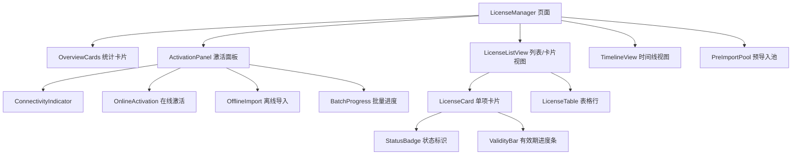
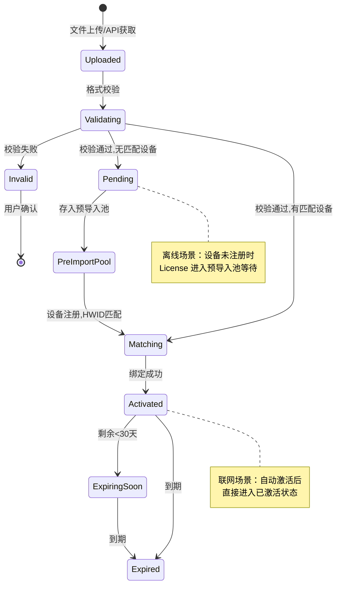
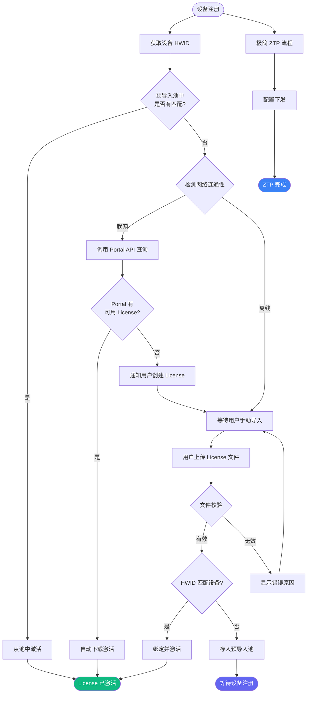
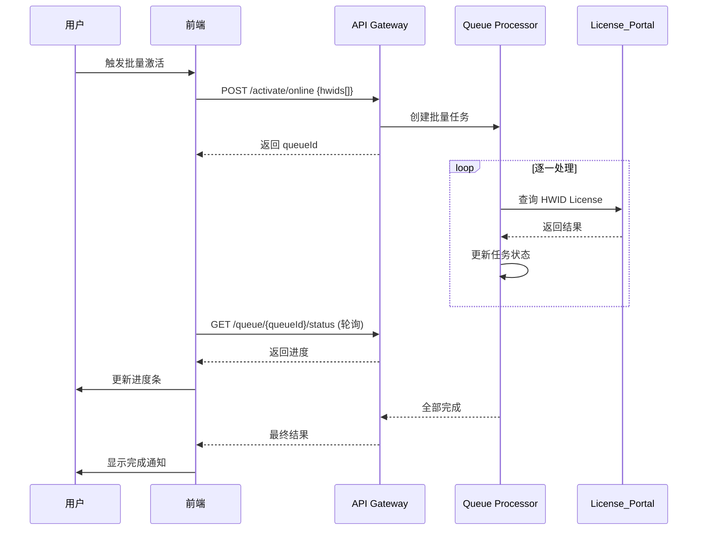
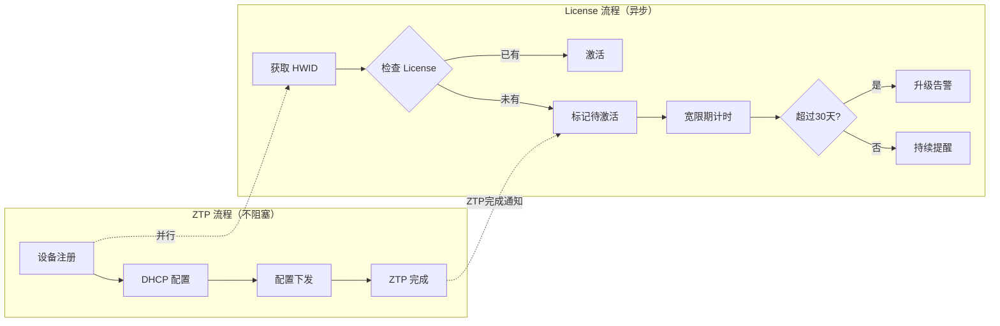

# 技术设计文档：License 激活流程优化

## 概述

本设计文档描述 AmpCon 数据中心控制器 License 激活流程优化的技术方案。核心目标是：

1. **解耦 License 与 ZTP 流程** — 设备上线不再被 License 状态阻塞
2. **双场景自适应** — 自动识别联网/离线环境并推荐最优激活路径
3. **预导入池机制** — 支持设备上架前预先导入 License，注册后自动匹配激活
4. **增强可视化** — 提供完整的 License 生命周期管理界面

技术栈：React 19 + TypeScript + Vite（前端），RESTful API（后端服务层）。

---

## 架构

### 高层架构图



### 联网与离线场景架构差异

| 维度 | 联网场景 | 离线场景 |
|------|----------|----------|
| 激活触发 | 设备注册后自动调用 License_Portal API | 用户手动上传 License_File |
| 数据流向 | AmpCon → License_Portal → AmpCon | 用户 → AmpCon（本地处理） |
| 批量处理 | 队列化 API 调用 | ZIP 包解析 + 本地匹配 |
| 错误恢复 | 重试 + 降级到离线模式 | 文件校验 + 错误报告 |
| 预导入 | 不适用（实时查询） | 预导入池 + 自动匹配 |



---

## 组件与接口

### 前端组件架构



### 核心前端组件接口

```typescript
// ===== License 管理主页面 =====
interface LicenseManagerProps {
  siteId?: string; // 可选，按站点筛选
}

// ===== 统计概览卡片 =====
interface OverviewCardsProps {
  statistics: LicenseStatistics;
}

interface LicenseStatistics {
  total: number;
  activated: number;
  notActivated: number;
  expiringSoon: number; // 30天内到期
  expired: number;
}

// ===== 激活面板 =====
interface ActivationPanelProps {
  connectivityStatus: ConnectivityStatus;
  onActivateOnline: (hwids: string[]) => Promise<ActivationResult[]>;
  onImportOffline: (files: File[]) => Promise<ImportResult[]>;
}

type ConnectivityStatus = 'online' | 'offline' | 'checking';

interface ActivationResult {
  hwid: string;
  success: boolean;
  error?: string;
  licenseId?: string;
}

interface ImportResult {
  fileName: string;
  hwid: string;
  status: 'matched' | 'pooled' | 'failed';
  error?: string;
  deviceName?: string;
}

// ===== License 列表视图 =====
interface LicenseListViewProps {
  licenses: License[];
  viewMode: 'list' | 'card';
  sortBy: LicenseSortField;
  sortOrder: 'asc' | 'desc';
  filter: LicenseStatusFilter;
  searchQuery: string;
  onViewModeChange: (mode: 'list' | 'card') => void;
  onSortChange: (field: LicenseSortField, order: 'asc' | 'desc') => void;
  onFilterChange: (filter: LicenseStatusFilter) => void;
  onSearch: (query: string) => void;
}

type LicenseSortField = 'activationTime' | 'expiryTime' | 'deviceName';
type LicenseStatusFilter = 'all' | 'activated' | 'not_activated' | 'expired' | 'expiring_soon';

// ===== 预导入池 =====
interface PreImportPoolProps {
  poolItems: PoolItem[];
  onDelete: (ids: string[]) => void;
  onExport: (ids: string[]) => void;
  onUpload: (files: File[]) => Promise<void>;
}

interface PoolItem {
  id: string;
  hwid: string;
  fileName: string;
  uploadTime: string;
  status: 'pending' | 'matched' | 'expired';
  matchedDeviceId?: string;
  matchedDeviceName?: string;
}
```

### 后端 API 接口设计

```typescript
// ===== License Service API =====

// POST /api/license/connectivity-check
// 检测与 License_Portal 的连通性
interface ConnectivityCheckResponse {
  status: 'connected' | 'disconnected' | 'timeout';
  latencyMs?: number;
  portalVersion?: string;
  checkedAt: string;
}

// POST /api/license/activate/online
// 在线激活（单个或批量）
interface OnlineActivateRequest {
  hwids: string[];
}
interface OnlineActivateResponse {
  results: ActivationResult[];
  queueId?: string; // 批量时返回队列ID
}

// POST /api/license/import
// 离线导入（支持单文件和ZIP）
// Content-Type: multipart/form-data
interface ImportResponse {
  results: ImportResult[];
  pooledCount: number;
  matchedCount: number;
  failedCount: number;
}

// GET /api/license/list
// 获取 License 列表
interface LicenseListRequest {
  page?: number;
  pageSize?: number;
  status?: LicenseStatusFilter;
  sortBy?: LicenseSortField;
  sortOrder?: 'asc' | 'desc';
  search?: string;
  siteId?: string;
}
interface LicenseListResponse {
  items: License[];
  total: number;
  statistics: LicenseStatistics;
}

// GET /api/license/timeline
// 获取到期时间线
interface TimelineResponse {
  items: TimelineItem[];
}
interface TimelineItem {
  licenseId: string;
  deviceName: string;
  hwid: string;
  expiryDate: string;
  daysRemaining: number;
  status: LicenseStatus;
}

// GET /api/license/pool
// 获取预导入池列表
interface PoolListResponse {
  items: PoolItem[];
  total: number;
}

// POST /api/license/pool/upload
// 上传到预导入池
// Content-Type: multipart/form-data

// DELETE /api/license/pool/:id
// 从预导入池删除

// POST /api/license/pool/export
// 导出预导入池记录
interface PoolExportRequest {
  ids: string[];
}

// GET /api/license/queue/:queueId/status
// 查询批量激活队列状态
interface QueueStatusResponse {
  queueId: string;
  total: number;
  completed: number;
  failed: number;
  pending: number;
  results: ActivationResult[];
}

// POST /api/system/config/license-portal
// 配置 License_Portal 连接参数
interface PortalConfigRequest {
  apiEndpoint: string;
  apiKey: string;
  apiSecret: string;
}
interface PortalConfigResponse {
  valid: boolean;
  connectionStatus: 'connected' | 'auth_failed' | 'unreachable';
  message?: string;
}
```

---

## 数据模型

### License 核心数据模型

```typescript
// License 状态枚举
type LicenseStatus = 'activated' | 'not_activated' | 'expiring_soon' | 'expired';

// License 类型
type LicenseType = 'perpetual' | 'subscription' | 'evaluation';

// License 实体
interface License {
  id: string;                    // License 唯一标识
  licenseKey: string;            // License 编号/序列号
  hwid: string;                  // 绑定的设备 HWID
  deviceId?: string;             // 绑定的设备 ID
  deviceName?: string;           // 绑定的设备名称
  type: LicenseType;             // License 类型
  status: LicenseStatus;         // 当前状态
  activationTime?: string;       // 激活时间 (ISO 8601)
  expiryDate: string;            // 到期时间 (ISO 8601)
  totalValidityDays: number;     // 总有效期天数
  remainingDays: number;         // 剩余天数
  validityRatio: number;         // 剩余/总有效期比例 (0-1)
  source: 'online' | 'import' | 'pre_import'; // 激活来源
  importedAt?: string;           // 导入时间
  fileHash?: string;             // License 文件哈希（用于去重）
}

// License 文件解析结果
interface ParsedLicenseFile {
  hwid: string;
  licenseKey: string;
  type: LicenseType;
  expiryDate: string;
  signature: string;
  isValid: boolean;
  errorMessage?: string;
}
```

### License 生命周期状态机



### 预导入池数据结构

```typescript
// 预导入池使用 HashMap<HWID, PoolEntry> 结构
// 核心匹配算法：O(1) 基于 HWID 的精确匹配

interface PreImportPool {
  entries: Map<string, PoolEntry>; // key = HWID
  totalCount: number;
  pendingCount: number;
  matchedCount: number;
  expiredCount: number;
}

interface PoolEntry {
  id: string;
  hwid: string;                   // 索引键
  licenseFileContent: string;     // Base64 编码的文件内容
  fileName: string;
  uploadTime: string;
  expiryDate: string;
  status: 'pending' | 'matched' | 'expired';
  matchedDeviceId?: string;
  matchedAt?: string;
}

// 匹配算法伪代码：
// function matchOnDeviceRegistration(hwid: string): PoolEntry | null {
//   const entry = pool.get(hwid);  // O(1) 查找
//   if (entry && entry.status === 'pending' && !isExpired(entry)) {
//     entry.status = 'matched';
//     return entry;
//   }
//   return null;
// }
```

### ZTP 流程中的 License 状态模型

```typescript
// 设备 ZTP 状态（扩展现有 Device 接口）
interface DeviceWithLicense extends Device {
  licenseStatus: LicenseStatus | 'pending_activation';
  licenseId?: string;
  ztpCompletedAt?: string;
  licenseGracePeriodEnd?: string;  // 宽限期截止时间
  licenseWarningLevel: 'none' | 'info' | 'warning' | 'critical';
}

// 宽限期配置
interface GracePeriodConfig {
  defaultDays: number;            // 默认 30 天
  warningThresholdDays: number;   // 警告阈值
  criticalAction: 'notify' | 'restrict'; // 超期动作
}
```

---

## 流程设计

### 完整 License 激活流程（优化后）



### 批量激活队列处理流程



### ZTP 与 License 解耦流程



---

## 界面设计方案

### 整体布局

License 管理界面采用三段式布局：

1. **顶部统计区** — 概览卡片，展示关键指标
2. **中部操作区** — 激活面板 + 视图切换
3. **底部数据区** — License 列表/卡片/时间线视图

### 统计卡片设计

```
┌─────────────────────────────────────────────────────────────────────┐
│  License Overview                                                     │
├──────────┬──────────┬──────────┬──────────┬──────────┐              │
│  总数     │  已激活   │  未激活   │  即将过期  │  已过期   │              │
│   128    │   102    │    15    │     8    │    3     │              │
│  ■ 全部   │  ■ 绿色   │  ■ 灰色   │  ■ 黄色   │  ■ 红色   │              │
└──────────┴──────────┴──────────┴──────────┴──────────┘              │
└─────────────────────────────────────────────────────────────────────┘
```

### 色彩编码体系

| 状态 | 颜色 | Tailwind Class | 含义 |
|------|------|----------------|------|
| 已激活 | 绿色 `#10b981` | `bg-emerald-500` | License 正常使用中 |
| 未激活 | 灰色 `#94a3b8` | `bg-slate-400` | 等待激活 |
| 即将过期 | 黄色 `#f59e0b` | `bg-amber-500` | 30天内到期 |
| 已过期 | 红色 `#ef4444` | `bg-red-500` | 已失效 |

### 双视图模式

**列表视图（Table View）：**
- 适合数据密集型管理操作
- 支持列排序、搜索、批量选择
- 每行展示：License编号、设备名、HWID、类型、状态Badge、有效期进度条、操作按钮

**卡片视图（Card View）：**
- 适合快速浏览和状态概览
- 每张卡片包含：设备名称、License类型、状态色彩标识、有效期环形进度、快捷操作

### 激活面板设计

```
┌─────────────────────────────────────────────────────────┐
│  License 激活                          ● 在线激活可用     │
│  ┌─────────────────┐  ┌─────────────────┐              │
│  │  🌐 在线激活     │  │  📁 本地导入     │              │
│  │  Quick Activate  │  │  Upload Files   │              │
│  │  [推荐]          │  │                 │              │
│  └─────────────────┘  └─────────────────┘              │
│                                                         │
│  连接状态: ✓ License Portal 已连接 (延迟: 45ms)         │
└─────────────────────────────────────────────────────────┘
```

### License 卡片组件设计

```
┌────────────────────────────────────┐
│  ■ Switch-Core-01                  │  ← 设备名称
│  LIC-2024-00128                    │  ← License 编号
│                                    │
│  类型: Subscription                │
│  HWID: 0A:1B:2C:3D:4E:5F         │
│                                    │
│  ████████████░░░░  78%            │  ← 有效期进度条
│  剩余 285 天 / 总计 365 天         │
│                                    │
│  [状态: 已激活 ●]    [详情 →]      │
└────────────────────────────────────┘
```

### 响应式断点

| 断点 | 宽度 | 布局调整 |
|------|------|----------|
| Desktop | ≥1280px | 完整布局，卡片4列 |
| Tablet | 768-1279px | 卡片2列，表格横向滚动 |
| Mobile | <768px | 卡片1列，简化表格 |

---

## 正确性属性（Correctness Properties）

*正确性属性是一种在系统所有有效执行中都应成立的特征或行为——本质上是对系统应做什么的形式化陈述。属性作为人类可读规范与机器可验证正确性保证之间的桥梁。*

### Property 1: 连通性检测结果有效性

*For any* 网络状态（连通、断开、高延迟、DNS 故障等），连通性检测函数应在 10 秒超时内返回一个有效的 `ConnectivityStatus` 值（'online' | 'offline'），且不抛出未处理异常。

**Validates: Requirements 1.1**

### Property 2: API 错误产生适当反馈

*For any* License_Portal API 调用失败类型（超时、401 认证失败、500 服务器错误、网络中断等），系统应返回包含非空错误描述的 `ActivationResult`，且 `success` 为 `false`。

**Validates: Requirements 2.5**

### Property 3: 批量激活队列顺序保持

*For any* 批量设备注册列表，队列处理器应按照提交顺序（FIFO）逐一处理每个 HWID 的激活请求，完成结果数组的顺序与输入顺序一致。

**Validates: Requirements 2.6**

### Property 4: ZIP 批量解析完整性

*For any* 包含 N 个有效 License 文件的 ZIP 压缩包，解析后应得到恰好 N 个 `ParsedLicenseFile` 结果，且每个结果的 `hwid` 字段非空。

**Validates: Requirements 3.2**

### Property 5: HWID 匹配与绑定正确性

*For any* License 文件中的 HWID 和 Parking_Lot 设备列表，若存在 HWID 完全匹配的设备，则该 License 应被绑定到该设备且设备 License 状态更新为 'activated'；若不存在匹配设备，则 License 应被存入预导入池。

**Validates: Requirements 3.3, 3.4, 3.6**

### Property 6: 无效文件拒绝与错误报告

*For any* 格式无效或损坏的文件内容（非法字节序列、错误格式、无效签名），License 文件解析函数应返回 `isValid: false` 且 `errorMessage` 为非空字符串。

**Validates: Requirements 3.5**

### Property 7: ZTP 流程不受 License 状态阻塞

*For any* 设备进入 ZTP 流程时的 License 状态（未激活、已过期、待激活），ZTP 配置下发应正常完成，且设备状态中应包含 'pending_activation' 警告标记。

**Validates: Requirements 4.1, 4.2**

### Property 8: 异步激活独立于 ZTP 时序

*For any* 已完成 ZTP 的设备，无论 ZTP 完成时间与 License 激活时间的先后关系如何，License 激活操作应能成功执行并将设备 License 状态更新为 'activated'。

**Validates: Requirements 4.4**

### Property 9: 宽限期告警升级

*For any* 设备注册时间 T 和宽限期配置 G（默认30天），当当前时间超过 T + G 且 License 仍未激活时，设备的 `licenseWarningLevel` 应为 'critical'；当未超过时，应为 'warning' 或更低。

**Validates: Requirements 4.5**

### Property 10: License 有效期进度比例计算

*For any* License 的总有效期天数 `totalDays` 和剩余天数 `remainingDays`（其中 0 ≤ remainingDays ≤ totalDays），`validityRatio` 应等于 `remainingDays / totalDays`，精度误差不超过 0.001。

**Validates: Requirements 5.2**

### Property 11: License 状态分类与色彩编码

*For any* License 的到期日期和当前时间，状态分类应满足：若已过期则状态为 'expired'（红色）；若剩余天数 < 30 且未过期则为 'expiring_soon'（黄色）；若已激活且剩余 ≥ 30 天则为 'activated'（绿色）；若未激活则为 'not_activated'（灰色）。状态与颜色映射应一一对应。

**Validates: Requirements 5.3, 5.4, 6.2**

### Property 12: 时间线排序正确性

*For any* License 列表，时间线视图中的排列顺序应严格按到期日期升序排列，即对于相邻的两个元素 items[i] 和 items[i+1]，items[i].expiryDate ≤ items[i+1].expiryDate。

**Validates: Requirements 5.5**

### Property 13: License 统计聚合正确性

*For any* License 集合 S，统计结果应满足：`total = |S|`，`activated + notActivated + expiringSoon + expired = total`（互斥分类），且每个分类计数等于 S 中对应状态的 License 数量。

**Validates: Requirements 5.6**

### Property 14: 设备 License 状态映射

*For any* 设备及其绑定的 HWID，设备列表中显示的 License 状态标识应与该 HWID 对应 License 的实际状态一致。若无绑定 License，则显示 'not_activated'。

**Validates: Requirements 5.7**

### Property 15: License 状态筛选正确性

*For any* 筛选条件 F 和设备列表 D，筛选结果应仅包含 License 状态匹配 F 的设备。当 F = 'all' 时返回全部设备；当 F = 'expiring_soon' 时仅返回剩余天数 < 30 的设备。

**Validates: Requirements 5.9**

### Property 16: License 排序与搜索

*For any* 排序字段和排序方向，License 列表应按指定字段正确排序。*For any* 搜索关键字 Q，搜索结果中每条记录的 License 编号、设备名称或 HWID 中应包含 Q（不区分大小写）。

**Validates: Requirements 6.5**

### Property 17: 预导入池存储完整性

*For any* 批量上传的 N 个有效 License 文件，预导入池中应新增恰好 N 条记录，每条记录的 HWID 作为索引键可被 O(1) 检索。

**Validates: Requirements 7.1**

### Property 18: 设备注册时预导入池自动匹配

*For any* 新注册设备的 HWID，若预导入池中存在状态为 'pending' 且未过期的同 HWID 记录，则该记录应被自动匹配并触发 License 激活；匹配后池中该记录状态应变为 'matched'。

**Validates: Requirements 7.2**

---

## 错误处理

### 错误分类与处理策略

| 错误类型 | 场景 | 处理策略 | 用户反馈 |
|----------|------|----------|----------|
| 网络错误 | Portal API 不可达 | 自动降级到离线模式 | 显示"离线模式"标识，提供手动导入入口 |
| 认证错误 | API 凭证无效/过期 | 提示重新配置 | 显示"凭证无效"，跳转系统配置 |
| 文件格式错误 | License 文件损坏 | 拒绝导入 | 显示具体错误原因（格式错误/签名失败） |
| 匹配失败 | HWID 无对应设备 | 存入预导入池 | 显示"已存入预导入池，待设备注册" |
| 超时错误 | API 响应超时 | 重试（最多3次） | 显示重试进度，3次失败后提供手动选项 |
| 批量部分失败 | 部分 License 激活失败 | 继续处理剩余项 | 显示成功/失败明细列表 |
| 宽限期超时 | 设备超过30天未激活 | 升级告警级别 | 发送通知，设备列表显示红色警告 |

### 重试策略

```typescript
interface RetryConfig {
  maxRetries: number;        // 默认 3
  baseDelayMs: number;       // 默认 1000ms
  maxDelayMs: number;        // 默认 10000ms
  backoffMultiplier: number; // 默认 2 (指数退避)
}

// 重试适用场景：
// - Portal API 调用超时
// - 网络瞬断
// - 服务端 5xx 错误
// 不重试场景：
// - 4xx 客户端错误（认证失败、参数错误）
// - 文件格式校验失败
```

---

## 测试策略

### 测试分层

| 层级 | 测试类型 | 覆盖范围 | 工具 |
|------|----------|----------|------|
| 单元测试 | Example-based | 组件渲染、工具函数、边界条件 | Vitest + React Testing Library |
| 属性测试 | Property-based | 核心业务逻辑（匹配、分类、排序、计算） | fast-check + Vitest |
| 集成测试 | API Mock | 前后端交互、状态流转 | MSW + Vitest |
| E2E 测试 | 场景测试 | 完整用户流程 | Playwright |

### 属性测试配置

- **测试库**: [fast-check](https://github.com/dubzzz/fast-check) (TypeScript 原生支持)
- **最小迭代次数**: 100 次/属性
- **标签格式**: `Feature: license-activation-optimization, Property {N}: {description}`

### 属性测试覆盖的核心逻辑

1. **HWID 匹配算法** — Property 5: 匹配正确性
2. **状态分类函数** — Property 11: 基于日期的状态判定
3. **进度计算** — Property 10: 比例计算精度
4. **排序逻辑** — Property 12, 16: 时间线和列表排序
5. **统计聚合** — Property 13: 分类计数一致性
6. **筛选逻辑** — Property 15: 过滤结果正确性
7. **文件校验** — Property 6: 无效输入拒绝
8. **宽限期判定** — Property 9: 时间阈值逻辑
9. **预导入池匹配** — Property 18: 自动匹配触发

### 单元测试覆盖的场景

- 连通性检测 UI 状态切换（Example: 1.2, 1.3, 1.4）
- 在线激活成功/失败 UI 反馈（Example: 2.3, 2.4）
- 批量导入进度显示（Example: 3.7）
- ZTP 完成后提醒通知（Example: 4.3）
- 设备详情 License 信息展示（Example: 5.8）
- 卡片/列表视图切换（Example: 6.3）
- 激活进度动画（Example: 6.4）
- 响应式布局断点（Example: 6.6）
- 预导入池管理操作（Example: 7.3, 7.5）

### 集成测试覆盖的场景

- Portal API 凭证验证流程（Integration: 2.1）
- 设备注册触发自动查询（Integration: 2.2）
- 在线自动下载激活（Integration: 2.3）
- 预导入池匹配后通知（Integration: 7.4）
