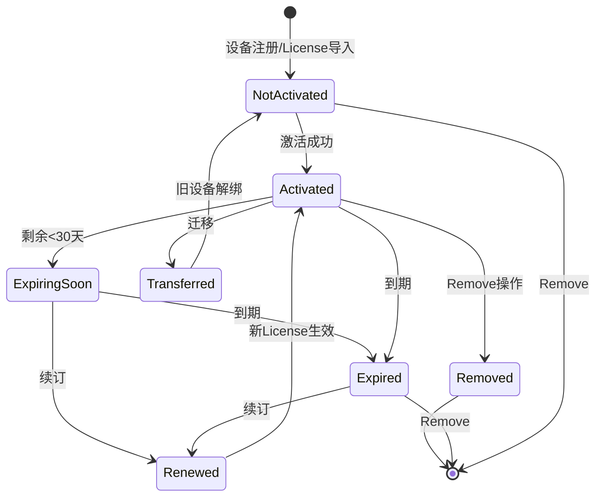
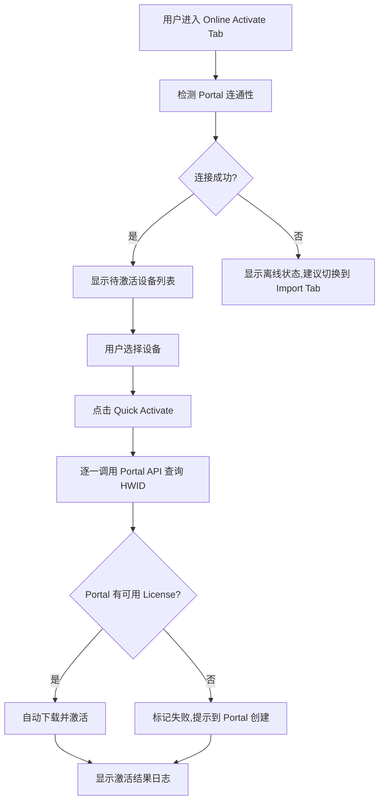
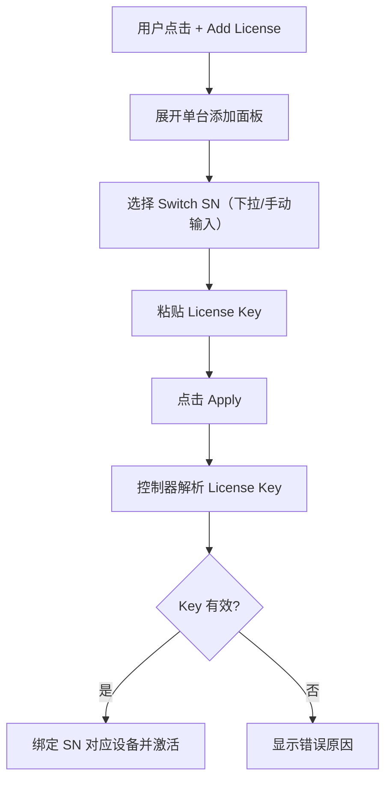
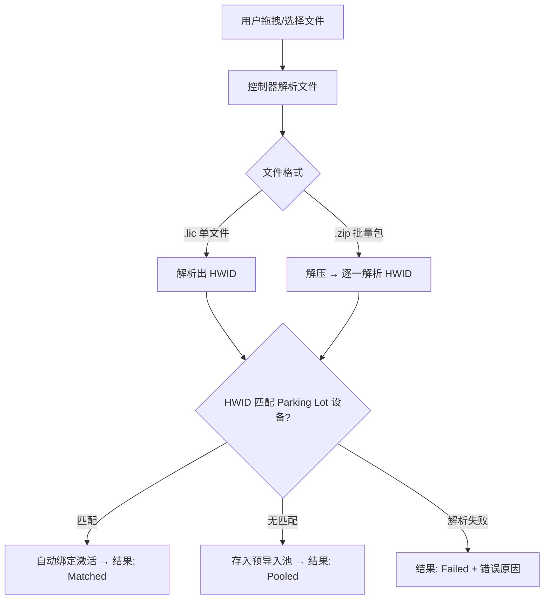
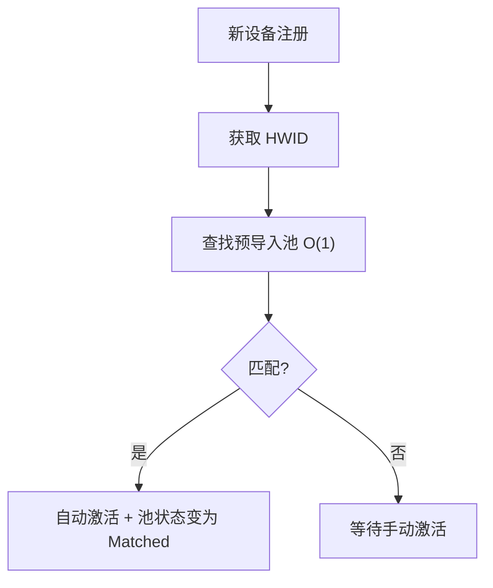

# AmpCon DC 控制器 PicOS License 管理优化 SR

| 项目 | 内容 |
|------|------|
| 文档编号 | SR-AMPCON-LICENSE-MGT-002 |
| 版本 | v3.0 |
| 日期 | 2026-05-12 |

---

# 一、功能说明

## 1.1 功能概述

本功能为 AmpCon 数据中心控制器提供 PicOS 交换机 License 的全生命周期管理能力，包括 License 激活（在线/离线）、续订、撤销、迁移、删除，以及 License 状态监控和到期预警。

## 1.2 功能范围

| 功能模块 | 说明 |
|----------|------|
| License Overview | License 列表查询、图形化统计、状态筛选、生命周期操作入口 |
| Online Activate | 连接 License Portal 在线激活（单台/批量） |
| Import License | 本地导入 License（单台 SN 添加 + 批量文件导入 + 预导入池） |
| 生命周期管理 | Renew（续订）、Transfer（迁移）、Remove（移除） |
| 到期预警 | 多级递进预警通知 |

## 1.3 License 绑定机制

- PicOS License 采用**硬件绑定模式**：License 与设备 HWID 一对一绑定
- 一个 License Key 可能包含多个 HWID（批量购买），由**控制器端解析**后分发
- License 文件绑定 HWID 后不可直接复用给其他设备，需通过 Portal 换发

## 1.4 术语表

| 术语 | 说明 |
|------|------|
| HWID | Hardware ID，设备硬件唯一标识符 |
| SN | Switch Serial Number，交换机序列号 |
| License Portal | Pica8 官方 License 管理门户 |
| License Key | Portal 生成的授权密钥（可能包含多个 HWID） |
| Parking Lot | 设备注册后等待配置的暂存区域 |
| Quick Activate | 在线快速激活功能 |
| Revoke Ticket | 撤销凭证，用于到 Portal 释放 License |
| Pre-Import Pool | 预导入池，设备注册前预先导入的 License 等待区 |

---

# 二、竞品功能设计及流程

## 2.1 说明

本章分析的是**控制器代管交换机功能 License** 的能力，即：
- 控制器帮助交换机激活/管理其自身的**功能授权**（如 RoCE、VXLAN、Routing 等功能模块）
- **不是**控制器自身的商业授权（如控制器能纳管多少台设备）

## 2.2 Arista CloudVision — 管理 EOS Feature License

**交换机功能 License 类型（EOS License Groups）：**

| License 级别 | 功能范围 | 类型 |
|-------------|----------|------|
| E (Base) | 基础 L2/L3、BGP、Multicast | 永久 |
| FLX Lite | E + BGP-EVPN for VXLAN | 永久 |
| FLX | FLX Lite + 大路由表 + MPLS | 永久 |

**CloudVision 管理交换机 License 的能力：**

| 功能 | 说明 |
|------|------|
| Upload & Install | 在 CVP 上传 License Key 文件，CVP 推送到对应交换机安装 |
| View Details | 查看每台交换机当前的 License 级别和到期信息 |
| Download & Delete | 从 CVP 下载或删除已上传的 License 文件 |
| 到期预警 | 4 级递进：90天警告 → 30天警告 → 7天错误 → 过期严重事件 |
| 自定义规则 | 用户可自定义 License 到期事件的触发规则 |
| API 管理 | 提供 License Assignment / PurchasedLicense / LicenseFile 等 gRPC API |

**关键特点：**
- License 绑定交换机 Serial Number，永久授权为主
- CVP 作为集中管理点，统一上传和分发 License 文件到各交换机
- 交换机本地也可以直接安装 License（CLI 方式），CVP 会同步状态

参考：[CloudVision License Management](https://www.arista.com/en/cg-cv/cv-license-management) | [EOS Feature Licensing](https://www.arista.com/support/product-documentation/eos-feature-licensing)

## 2.3 Cisco Catalyst Center — 管理交换机 Network Essentials/Advantage License

**交换机功能 License 类型（Catalyst 9000 系列）：**

| License 级别 | 功能范围 | 类型 |
|-------------|----------|------|
| Network Essentials | 基础 L2/L3、QoS、安全 ACL | 永久 |
| Network Advantage | Essentials + VXLAN-EVPN、SD-Access、高级路由 | 订阅 |
| DNA Essentials | 基础自动化、监控 | 订阅 |
| DNA Advantage | 高级分析、AI/ML、ThousandEyes | 订阅 |

**Catalyst Center 管理交换机 License 的能力：**

| 功能 | 说明 |
|------|------|
| License Overview | 按设备类型（Switch/Router/Wireless）分类展示已购/在用/可用数量 |
| Change License Level | 在控制器上直接变更交换机的 License 级别（Essentials ↔ Advantage） |
| Register / Deregister | 注册或注销交换机的 Smart License |
| License Reservation | 为离线交换机预留 License（SLR/PLR） |
| CSLU 代理 | 控制器作为 CSLU 角色，代理交换机与 Cisco 云端通信 |
| 合规性报告 | 展示交换机 License 使用是否合规（购买量 vs 使用量） |
| License Migration | 支持在 Virtual Account 间迁移交换机 License |

**关键特点：**
- 控制器充当 CSLU（Cisco Smart License Utility）角色，是交换机和云端之间的代理
- 交换机通过 SLUP（Smart Licensing Using Policy）向控制器上报 License 使用情况
- 控制器可以直接变更交换机的功能级别（如从 Essentials 升级到 Advantage）
- 支持离线场景（air-gapped），控制器本地管理不需要联网

参考：[Catalyst Center License Manager](https://www.cisco.com/c/en/us/td/docs/cloud-systems-management/network-automation-and-management/catalyst-center/articles/licenses-cc-article.html)

## 2.4 华为 iMaster NCE-Fabric — 管理 CloudEngine 交换机 N1 软件包 License

**交换机功能 License 类型（CloudEngine N1 软件包）：**

| License 包 | 功能范围 | 类型 |
|-----------|----------|------|
| Management Package | 基础管理、M-LAG 维护模式升级 | 永久 + SnS 年费 |
| Foundation Package | NCE-Fabric 管理、FabricInsight 基础分析、Telemetry、IOAM | 永久 + SnS 年费 |
| Digital Map Navigate | 数字地图导航场景 | 永久 + SnS 年费 |

**NCE-Fabric 管理交换机 License 的能力：**

| 功能 | 说明 |
|------|------|
| Upload License | 在 NCE 上传 License 文件，NCE 分发到对应交换机 |
| 全局永久 License | N1 模式下，NCE 获取全局 License 后，交换机无需单独加载 |
| License 再分配 | 支持 License 在设备间重新分配（Redistribution） |
| Revoke Ticket | 生成撤销码，用于到 Portal 释放并换发新 License |
| SnS 年费管理 | 管理订阅年费的有效期，年费过期后功能仍可用但不可升级 |

**关键特点：**
- N1 模式下，License 包含控制器 + 交换机的功能授权，是捆绑销售
- NCE 获取全局 License 后，被管交换机**不需要单独加载 License 文件**
- 支持 License 在设备间迁移（通过 Revoke Ticket 机制）
- 区分永久 License（功能授权）和 SnS 年费（升级维护服务）

参考：[CloudEngine License Usage Guide](https://support.huawei.com/enterprise/en/doc/EDOC1000150334/e5ca4473/overview-of-licenses) | [N1 Business Model](https://info.support.huawei.com/info-finder/encyclopedia/en/CloudFabric+N1+Business+Model.html)

## 2.5 竞品对比总结（聚焦交换机功能 License 管理）

| 对比维度 | Arista CVP | Cisco Catalyst Center | 华为 NCE-Fabric | AmpCon 现状 |
|----------|-----------|----------------------|----------------|-------------|
| 管理对象 | EOS Feature License（E/FLX Lite/FLX） | Network Essentials/Advantage + DNA | N1 软件包（Management/Foundation） | PicOS 功能 License |
| 绑定方式 | Serial Number | UDI（设备唯一标识） | HWID / 全局模式 | HWID |
| 上传/安装 | ✅ CVP 上传推送到交换机 | ✅ 控制器代理注册 | ✅ NCE 上传分发 | ✅ 手动导入/Quick Activate |
| 级别变更 | ❌ 需重新购买 | ✅ 在线变更级别 | ❌ 需重新购买 | ❌ 不支持 |
| 到期预警 | ✅ 4级递进 + 自定义规则 | ✅ 合规性仪表盘 | ✅ SnS 年费到期提醒 | ❌ 无预警 |
| 撤销/迁移 | ✅ Delete + 重新上传 | ✅ Deregister + 迁移 | ✅ Revoke Ticket 换发 | ❌ 不支持 |
| 离线支持 | ✅ 文件上传 | ✅ SLR/PLR 预留 | ✅ 文件上传 | ✅ 本地导入 |
| 预导入 | ❌ | ✅ License Reservation | ✅ 全局模式自动分配 | ❌ 不支持 |
| 批量管理 | ✅ 批量上传 | ✅ 批量注册 | ✅ 全局分发 | ⚠️ 仅单文件 |
| 合规性展示 | ✅ 事件级别 | ✅ 购买量 vs 使用量 | ✅ 年费状态 | ❌ 无 |

## 2.6 对 AmpCon 的启示

| 差距 | 优化方向 | 优先级 |
|------|----------|--------|
| 无生命周期管理 | 补全 Renew/Transfer/Remove | P0 |
| 无到期预警 | 增加多级递进预警（对标 CVP 4级） | P0 |
| 无图形化统计 | 增加环形图 + 合规率（对标 Cisco 合规仪表盘） | P1 |
| 无预导入 | 增加 Pre-Import Pool（对标 Cisco License Reservation） | P1 |
| 无批量导入 | 支持 ZIP 批量 + 多 HWID Key 解析 | P1 |
| 无单台快捷添加 | 增加 SN + Key 单台入口 | P2 |
| 无 License 级别展示 | 展示交换机当前功能 License 级别 | P2 |

---

# 三、功能业务流程

## 3.1 License 生命周期状态机



## 3.2 Activate（激活）流程

### 3.2.1 在线激活（Online Activate）



### 3.2.2 离线导入 — 单台添加



### 3.2.3 离线导入 — 批量导入



### 3.2.4 预导入池自动匹配



## 3.3 Renew（续订）流程

**触发条件：** License 状态为 Expiring Soon 或 Expired

**联网模式：**
1. 用户点击 Renew → AmpCon 调用 Portal API（传入 HWID）
2. Portal 返回新 License → AmpCon 替换旧 License → 状态变为 Activated
3. Portal 无续订 License → 提示用户到 Portal 购买，提供跳转链接

**离线模式：**
1. 用户点击 Renew → 弹窗提示"请到 License Portal 购买续订"
2. 用户到 Portal 购买 → 下载新 License 文件（同 HWID）
3. 回到 Import Tab 导入 → 系统识别为续订（同 HWID）→ 替换旧 License

**本质：** 用新 License 替换旧 License，HWID 绑定关系不变。

## 3.4 Remove（移除）流程

**触发条件：** 所有状态均可执行

**业务场景：** 设备下架退役、清理无效记录、License 不再使用

**说明：** 由于 PicOS License 与 HWID 一对一绑定，撤销后 License 无法复用给其他设备，因此将 Revoke（撤销）和 Delete（删除）合并为一个 "Remove" 操作。

**流程：**
1. 用户点击 Remove → 确认对话框（二次确认）
2. 若 License 当前为已激活状态：AmpCon 向交换机下发清除 License 命令
3. 联网模式：调用 Portal API 通知该 License 已释放
4. 离线模式：生成 Revoke Ticket 供用户到 Portal 手动释放
5. 从 AmpCon 数据库中移除该 License 记录

**注意：** 若需要将 License 转移到新设备，应使用 Transfer 操作（而非 Remove + 重新导入）。

## 3.5 Transfer（迁移）流程

**触发条件：** License 状态为 Activated 或 Expiring Soon

**业务场景：** 设备 RMA（返修替换）、硬件升级

**联网模式：**
1. 用户点击 Transfer → 弹窗选择目标新设备（新 HWID）
2. AmpCon 调用 Portal API：传入旧 HWID + 新 HWID
3. Portal 作废旧 License → 生成绑定新 HWID 的新 License
4. AmpCon 解绑旧设备 + 激活新设备

**离线模式：**
1. 用户点击 Transfer → 弹窗选择目标新设备
2. AmpCon 生成 Revoke Ticket + 显示新设备 HWID
3. 提示用户到 Portal：用 Revoke Ticket + 新 HWID 换发新 License
4. 用户下载新 License → 回到 Import 导入 → 自动激活新设备

**本质：** Remove（旧）+ Portal 换发 + Activate（新）的组合操作。

---

# 四、原型界面交互说明

## 4.1 页面结构

```
┌─────────────────────────────────────────────────────────────────────┐
│  License Management                                                   │
│  Manage PicOS switch licenses across your data center fabric          │
├─────────────────────────────────────────────────────────────────────┤
│  [ License Overview ]  [ Online Activate ]  [ Import License ]        │
├─────────────────────────────────────────────────────────────────────┤
│                                                                       │
│  (Tab 内容区域)                                                        │
│                                                                       │
└─────────────────────────────────────────────────────────────────────┘
```

## 4.2 License Overview Tab

### 布局

```
┌─────────────────────────────────────────────────────────────────────┐
│  ┌─────────┐   Activated    4 (50%)      │  Compliance  │           │
│  │ 环形图   │   Expiring    2 (25%)      │     50%      │           │
│  │  总数 8  │   Not Active  1 (12.5%)    │   4/8 合规   │           │
│  └─────────┘   Expired     1 (12.5%)    │              │           │
├─────────────────────────────────────────────────────────────────────┤
│  [All 8] [Activated 4] [Not Activated 1] [Expiring 2] [Expired 1]   │
│                                                    🔍 Search...      │
├─────────────────────────────────────────────────────────────────────┤
│  Sysname │ IP │ HWID │ Version │ Status │ Validity │ Expiry │ ⋮    │
│  ─────────────────────────────────────────────────────────────────  │
│  DC-Core-01 │ 10.1.1.1 │ 0A:1B:... │ 4.6.1 │ ●Activated │ ██░ │ ⋮│
│  DC-Leaf-03 │ 10.1.2.3 │ 2C:3D:... │ 4.6.1 │ ●Expiring  │ █░░ │ ⋮│
└─────────────────────────────────────────────────────────────────────┘
```

### 交互说明

| 交互 | 行为 |
|------|------|
| 点击筛选按钮 | 表格按状态过滤，按钮高亮 |
| 输入搜索关键字 | 实时过滤（按 Sysname/HWID/IP 模糊匹配） |
| 点击表头列名 | 按该列排序（升序/降序切换） |
| 点击行末 ⋮ 按钮 | 弹出操作下拉菜单 |
| 环形图各色段 hover | 显示该状态的详细数量 |

### Action 下拉菜单

| 菜单项 | 适用状态 | 点击行为 |
|--------|----------|----------|
| View Details | 所有 | 弹出 License 详情面板（含 Info + History） |
| Renew | Expiring Soon / Expired | 触发续订流程 |
| Transfer | Activated / Expiring Soon | 弹出目标设备选择弹窗 → 执行迁移 |
| Remove | 所有 | 弹出确认对话框 → 清除交换机 License + 删除记录 |

## 4.5 View Details 详情面板

### 布局

```
┌─────────────────────────────────────────────────────┐
│  ← Back    License Details                           │
├─────────────────────────────────────────────────────┤
│  DC-Core-01                          ● Activated     │
│  LIC-2024-00128                                      │
├─────────────────────────────────────────────────────┤
│  [ Info ]  [ History ]                               │
├─────────────────────────────────────────────────────┤
│  Info Tab:                                           │
│  License ID      LIC-2024-00128                      │
│  Switch SN       SN-A1B2C3                           │
│  Hardware ID     0A:1B:2C:3D:4E:5F                   │
│  Type            Subscription                        │
│  Activation Time 2025-12-15 10:30:00                 │
│  Expiry Date     2026-12-15                          │
│  Total Validity  365 days                            │
│  Remaining       217 days                            │
│  Source          Online Activate                     │
├─────────────────────────────────────────────────────┤
│  History Tab:                                        │
│  2025-12-15 10:30  admin   Activated (Online)        │
│  2025-12-15 10:29  system  Portal API queried        │
│  2025-12-15 10:28  system  HWID matched              │
│  2025-12-14 09:00  admin   Imported to Pre-Pool      │
└─────────────────────────────────────────────────────┘
```

### Info Tab 字段

| 字段 | 说明 |
|------|------|
| License ID | License 唯一编号 |
| Switch SN | 绑定的交换机序列号 |
| Hardware ID | 绑定的 HWID |
| Type | Subscription / Perpetual / Evaluation |
| Activation Time | 激活时间 |
| Expiry Date | 到期日期 |
| Total Validity | 总有效期天数 |
| Remaining | 剩余天数 |
| Source | 激活来源（Online / Import / Pre-Import Pool） |
| PicOS Version | 设备当前 PicOS 版本 |
| IP Address | 设备管理 IP |

### History Tab 字段

| 字段 | 说明 |
|------|------|
| Time | 操作时间 |
| User | 操作人（system 表示自动操作） |
| Action | 操作描述（Activated / Renewed / Transferred / Removed / Imported 等） |

### 交互说明

| 交互 | 行为 |
|------|------|
| 点击 ← Back | 关闭详情面板，回到列表 |
| 切换 Info / History Tab | 切换显示内容 |
| History 列表 | 按时间倒序排列，最新操作在最上面 |

## 4.3 Online Activate Tab

### 布局

```
┌─────────────────────────────────────────────────────────────────────┐
│  ✓ License Portal Connected | Latency: 45ms | API v2.1              │
│                                          [Test] [Open Portal ↗]     │
├─────────────────────────────────────────────────────────────────────┤
│  Devices Pending Activation (2)     [Select All] [⚡Quick Activate] │
├─────────────────────────────────────────────────────────────────────┤
│  ☐ DC-Spine-02  HWID: 4E:5F:...  10.1.1.2   ○ Not Activated       │
│  ☐ DC-Leaf-07   HWID: 6A:7B:...  10.1.3.7   ○ Expired             │
├─────────────────────────────────────────────────────────────────────┤
│  (激活结果日志区域)                                                    │
│  ✓ DC-Spine-02  License activated                                    │
│  ✗ DC-Leaf-07   No license found on Portal  [Retry]                 │
└─────────────────────────────────────────────────────────────────────┘
```

### 交互说明

| 交互 | 行为 |
|------|------|
| 点击 Test | 重新检测 Portal 连通性，更新状态指示器 |
| 点击 Open Portal | 新窗口打开 License Portal 网站 |
| 点击设备行 | 切换选中/取消选中 |
| 点击 Select All | 全选所有待激活设备 |
| 点击 Quick Activate | 批量激活，显示进度条 + 结果日志 |
| 点击 Retry | 对失败设备重新尝试激活 |
| Portal 未连接时 | Quick Activate 按钮置灰不可点击 |

## 4.4 Import License Tab

### 布局

```
┌─────────────────────────────────────────────────────────────────────┐
│  Add License                                          [+ Add License]│
│  Add license for a single device by Switch SN                        │
│  ┌──────────────────────────────────────────────────────────────┐   │
│  │ Switch SN *        │ License Key *                    │[Apply]│   │
│  │ [SN-G7H8I9    ▾]  │ [粘贴 License Key...]            │       │   │
│  └──────────────────────────────────────────────────────────────┘   │
├─────────────────────────────────────────────────────────────────────┤
│  ┌─ ─ ─ ─ ─ ─ ─ ─ ─ ─ ─ ─ ─ ─ ─ ─ ─ ─ ─ ─ ─ ─ ─ ─ ─ ─ ─ ─┐   │
│  │         ☁ Drag & Drop License Files Here                    │   │
│  │         Supports .lic or .zip batch package                 │   │
│  │              [Select File]  [Batch (ZIP)]                   │   │
│  └─ ─ ─ ─ ─ ─ ─ ─ ─ ─ ─ ─ ─ ─ ─ ─ ─ ─ ─ ─ ─ ─ ─ ─ ─ ─ ─ ─┘   │
├─────────────────────────────────────────────────────────────────────┤
│  Pre-Import Pool (2 pending)                            [Export]     │
│  HWID │ File │ Upload Time │ Status │ Action                        │
│  FF:00:11:... │ license_FF.lic │ 2026-05-10 │ Pending │ 🗑          │
│  AA:BB:CC:... │ license_AA.lic │ 2026-05-08 │ Pending │ 🗑          │
└─────────────────────────────────────────────────────────────────────┘
```

### 交互说明

| 交互 | 行为 |
|------|------|
| 点击 + Add License | 展开/折叠单台添加面板 |
| Switch SN 下拉 | 显示 Parking Lot 中已注册设备的 SN 列表 |
| 粘贴 License Key | 文本框接受粘贴内容 |
| 点击 Apply | 校验 + 激活单台设备 |
| 拖拽文件到虚线区域 | 区域变蓝高亮，松开后开始解析 |
| 点击 Select File | 打开文件选择器（.lic） |
| 点击 Batch (ZIP) | 打开文件选择器（.zip） |
| 导入完成 | 显示结果明细（Matched/Pooled/Failed） |
| 点击预导入池 🗑 | 删除该条预导入记录 |
| 点击 Export | 导出未匹配的预导入记录 |

---

# 五、列表字段提示说明

## 5.1 License Overview 表格字段

| 字段 | 类型 | 说明 | 示例 |
|------|------|------|------|
| Sysname | 文本 | 交换机设备名称 | DC-Core-01 |
| IP Address | 文本 | 设备管理 IP | 10.1.1.1 |
| Hardware ID | 文本 | 设备硬件唯一标识（MAC 格式） | 0A:1B:2C:3D:4E:5F |
| Version | 文本 | PicOS 软件版本 | PicOS 4.6.1 |
| License Status | Badge | 当前 License 状态（色彩编码） | ● Activated |
| Validity | 进度条 | 剩余有效期占总有效期比例 + 剩余天数 | ████░░ 217d |
| Expiry Date | 日期 | License 到期日期 | 2026-12-15 |
| Action | 菜单 | 生命周期操作入口（三点菜单） | ⋮ |

## 5.2 状态 Badge 色彩编码

| 状态 | 颜色 | 色值 | 含义 |
|------|------|------|------|
| Activated | 绿色 | #10b981 | License 正常使用中 |
| Not Activated | 灰色 | #94a3b8 | 等待激活 |
| Expiring Soon | 黄色 | #f59e0b | 30天内到期 |
| Expired | 红色 | #ef4444 | 已失效 |

## 5.3 预导入池表格字段

| 字段 | 类型 | 说明 | 示例 |
|------|------|------|------|
| HWID | 文本 | License 绑定的硬件 ID | FF:00:11:22:33:44 |
| File | 文本 | 上传的文件名 | license_FF0011.lic |
| Upload Time | 日期时间 | 上传时间 | 2026-05-10 14:30 |
| Status | Badge | 匹配状态 | Pending / Matched / Expired |
| Action | 按钮 | 删除操作 | 🗑 |

## 5.4 Validity 进度条规则

| 条件 | 进度条颜色 | 显示文本 |
|------|-----------|----------|
| 剩余 > 30天 | 绿色 #10b981 | {remainingDays}d |
| 剩余 1-30天 | 黄色 #f59e0b | {remainingDays}d |
| 已过期 | 红色 #ef4444 | Expired |
| 未激活 | 无进度条 | -- |

## 5.5 Compliance Score 计算

```
Compliance = (Activated 数量 / Total 数量) × 100%
```

- 100% = 全部合规（绿色）
- < 100% 且无 Expired = 部分合规（黄色）
- 存在 Expired = 不合规（橙色）

---

# 六、异常与容错处理

## 6.1 网络异常

| 异常场景 | 处理策略 | 用户反馈 |
|----------|----------|----------|
| Portal API 不可达 | 自动降级到离线模式 | 状态指示器变红 + 提示"Portal 不可用，请使用本地导入" |
| API 调用超时（>10s） | 重试 3 次（指数退避：1s/2s/4s） | 显示重试进度 |
| 3 次重试均失败 | 停止重试 | 显示失败原因 + Retry 按钮 + 建议切换离线模式 |
| API 认证失败（401） | 不重试 | 提示"API 凭证无效，请检查 System Configuration" |
| API 服务端错误（5xx） | 重试 3 次 | 显示"Portal 服务异常，请稍后重试" |

## 6.2 文件导入异常

| 异常场景 | 处理策略 | 用户反馈 |
|----------|----------|----------|
| 文件格式无效 | 拒绝导入 | 显示"文件格式错误，仅支持 .lic 或 .zip" |
| License Key 签名校验失败 | 拒绝该条 | 结果标记 Failed + "签名校验失败" |
| ZIP 包损坏无法解压 | 拒绝整个包 | 显示"ZIP 文件损坏，请重新下载" |
| HWID 格式不合法 | 拒绝该条 | 结果标记 Failed + "HWID 格式错误" |
| 重复导入（同 HWID 已存在） | 提示覆盖确认 | 弹窗"该 HWID 已有 License，是否覆盖？" |
| 文件大小超限（>10MB） | 拒绝 | 显示"文件大小超过限制" |

## 6.3 生命周期操作异常

| 异常场景 | 处理策略 | 用户反馈 |
|----------|----------|----------|
| Remove 时设备离线 | 本地删除记录，设备上线后补发清除命令 | 提示"设备当前离线，将在设备上线后完成清除" |
| Transfer 时 Portal 无法换发 | 操作失败，保持原状态 | 显示 Portal 返回的错误原因 |
| Renew 时 Portal 无续订 License | 操作失败 | 提示"Portal 无可用续订，请先购买" + 跳转链接 |
| Delete 时 License 状态为 Activated | 阻止操作 | 提示"已激活的 License 不可直接删除，请先撤销" |
| 批量激活部分失败 | 继续处理剩余项 | 结果日志逐条显示成功/失败 |

## 6.4 并发与冲突

| 场景 | 处理策略 |
|------|----------|
| 多人同时操作同一 License | 乐观锁，后提交者提示"该 License 状态已变更，请刷新" |
| 预导入池匹配与手动激活冲突 | 先到先得，后触发的操作提示"该设备已被激活" |
| 设备注册时预导入池 License 已过期 | 跳过该条，不自动激活，池中标记 Expired |

---

# 七、权限控制要求

## 7.1 角色权限矩阵

| 操作 | Super Admin | Network Admin | Operator | Viewer |
|------|:-----------:|:-------------:|:--------:|:------:|
| 查看 License 列表 | ✅ | ✅ | ✅ | ✅ |
| 查看 License 详情 | ✅ | ✅ | ✅ | ✅ |
| 在线激活 | ✅ | ✅ | ✅ | ❌ |
| 本地导入 | ✅ | ✅ | ✅ | ❌ |
| 单台添加 | ✅ | ✅ | ✅ | ❌ |
| Renew（续订） | ✅ | ✅ | ❌ | ❌ |
| Transfer（迁移） | ✅ | ✅ | ❌ | ❌ |
| Remove（移除） | ✅ | ✅ | ❌ | ❌ |
| 配置 Portal API 凭证 | ✅ | ❌ | ❌ | ❌ |
| 管理预导入池 | ✅ | ✅ | ✅ | ❌ |

## 7.2 权限说明

- **Super Admin**：全部权限，包括删除和系统配置
- **Network Admin**：日常管理操作（激活、续订、撤销、迁移），不可删除和修改系统配置
- **Operator**：执行性操作（激活、导入），不可执行生命周期变更操作
- **Viewer**：只读，仅查看 License 状态

## 7.3 操作审计

所有生命周期操作需记录审计日志：

| 记录字段 | 说明 |
|----------|------|
| 操作时间 | ISO 8601 格式 |
| 操作人 | 用户名 + 角色 |
| 操作类型 | Activate / Renew / Transfer / Remove / Import |
| 目标对象 | License ID + 设备 SN + HWID |
| 操作结果 | 成功 / 失败 + 原因 |
| 来源 | Online / Import / Pre-Import Pool |

---

# 八、功能约束与边界

## 8.1 功能边界

| 约束项 | 说明 |
|--------|------|
| License 绑定模式 | 仅支持 HWID 绑定模式，不支持池化模式 |
| 复用限制 | License 不可直接复用给其他设备，需通过 Portal 换发 |
| Portal 依赖 | 在线激活、续订、迁移依赖 Portal API 可用性 |
| 解析位置 | License Key 解析在控制器端完成，交换机只接收分发结果 |
| 单 Key 多设备 | 支持一个 License Key 包含多个 HWID，控制器解析后逐一分发 |
| 预导入池容量 | 最大 1000 条预导入记录 |
| 批量导入限制 | 单次最大 100 个文件 / ZIP 包最大 50MB |
| 文件格式 | 仅支持 .lic 和 .zip 格式 |

## 8.2 不在本期范围

| 项目 | 说明 | 计划版本 |
|------|------|----------|
| License 池化模式 | 类似 Cisco Smart Account 的池化分配 | V3.0 |
| 自动续订 | License 到期前自动购买续订 | V2.5 |
| License 使用趋势图 | 历史使用量统计图表 | V2.0 |
| 多租户 License 管理 | 按租户隔离 License 资源 | V3.0 |
| License 合规性报告导出 | PDF/CSV 格式合规报告 | V2.0 |

## 8.3 性能要求

| 指标 | 要求 |
|------|------|
| License 列表加载 | < 2 秒（1000 条以内） |
| Portal 连通性检测 | < 10 秒超时 |
| 单台激活响应 | < 5 秒 |
| 批量激活（100台） | < 5 分钟 |
| 预导入池匹配 | O(1) 时间复杂度 |
| 文件解析（单文件） | < 1 秒 |
| ZIP 解析（100文件） | < 10 秒 |

## 8.4 到期预警配置

| 参数 | 默认值 | 可配置 |
|------|--------|--------|
| 提醒阈值 | 90 天 | ✅ |
| 警告阈值 | 30 天 | ✅ |
| 严重阈值 | 7 天 | ✅ |
| 通知方式 | 站内通知 | ✅（可选邮件/Webhook） |
| 检查频率 | 每日 00:00 | ✅ |
